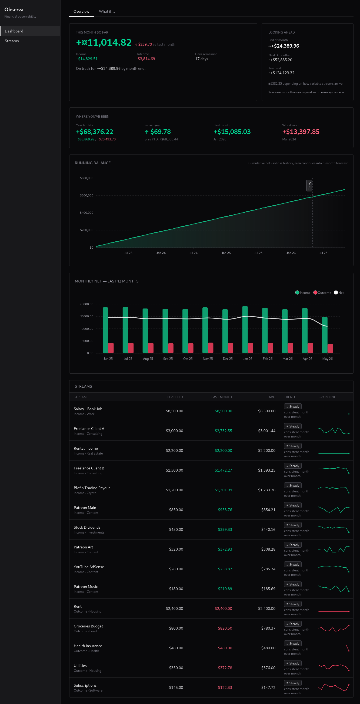

# Observa



Self-hosted financial observability. A focused dashboard for personal income and outcome streams that answers three questions:

1. **Where have I been?** — year-to-date net, year-over-year delta, best and worst months, cumulative running balance.
2. **Where am I?** — net flow for the current month, broken down by stream and category.
3. **Where am I going?** — projected end-of-month, three-month, and year-end net, plus per-stream trend and runway.

Observa is intentionally macro: it tracks the *streams* (salary, Patreon, subscriptions, housing, etc.), not every individual transaction. Detail-level budgeting is out of scope — that is what a budgeting app is for. Observa is the dashboard above it.

## Stack

| Concern | Choice |
|---|---|
| Runtime | .NET 10, C# 14 (LangVersion=preview) |
| UI | Blazor Server + Tailwind CSS v4 |
| Charts | [Blazor-ApexCharts](https://github.com/joadan/Blazor-ApexCharts) |
| Domain | [Crucible](https://github.com/rick-dev-creator/crucible) — DDD framework with source generators |
| State / persistence | Orleans 9.x with PostgreSQL provider (grain storage + reminders) |
| Orchestration (dev) | .NET Aspire 13 (AppHost manages Postgres + Web) |
| Orchestration (prod) | Docker Compose |
| Currency | USD only (no multi-currency in this version) |

The chain pattern of Crucible is the dispatcher; there is no MediatR or equivalent. Each request flows `Blazor → Service → Crucible chain → Aggregate → Handler → Orleans grain → Response`. Connectors (Patreon today; Stripe, bank, CSV as next slices) live in their own feature and are called from the orchestrator, never from inside a grain.

## Architecture

Vertical slices. Crucible enforces the domain shape at compile time (private constructors, factory methods, typestate composition, 27 build-time diagnostics), so the codebase does not need horizontal layering (Domain/Application/Infrastructure). Each feature owns its aggregate, grain, service, events, handlers, and pages.

```
src/
├── Observa.AppHost/                 Aspire orchestrator: Postgres + Web (dev only)
├── Observa.ServiceDefaults/         Shared service config: OTel, health checks
├── Observa.Connectors.Abstractions/ IConnector + ConnectorFlowEvent contract
├── Observa.Connectors.Patreon/      Patreon API v2 connector with historical backfill
└── Observa.Web/                     Blazor Server + Orleans silo (co-hosted)
    ├── Program.cs
    ├── Dockerfile                   Multi-stage build (.NET SDK + Node for Tailwind)
    ├── Styles/app.tailwind.css      Tailwind input
    └── Features/                    Vertical slices
        ├── Streams/                 Stream aggregate, grain, services, pages
        └── Connectors/              Manual, Recurring, plus registry + orchestrator
```

## Self-hosted deployment

Observa ships with a `compose.yml` for production-style deployment.

### Prerequisites

- Docker 25+ with the Compose plugin
- A Patreon Creator Access Token if you want to connect a Patreon campaign (optional)

### First-time setup

```bash
git clone https://github.com/rick-dev-creator/Observa.git
cd Observa

cp .env.example .env
# Edit .env and set at minimum:
#   POSTGRES_PASSWORD       any value, used to initialise the Postgres volume
#   PATREON_ACCESS_TOKEN    your Patreon Creator Access Token (optional)

docker compose up -d --build
```

Open `http://localhost:8080` (or whatever `WEB_PORT` you set). The seed data only runs in `Development`; the container starts in `Production`, so the first screen is the empty-state asking you to register your first stream.

### Day-to-day commands

```bash
docker compose logs -f web      # follow web logs
docker compose down             # stop, keep the postgres volume
docker compose down -v          # stop and erase data
docker compose up -d --build    # rebuild image and restart
```

### Security model

Observa runs **without authentication**. It assumes deployment on a private network (LAN, Tailscale, Cloudflare Tunnel) or behind an auth proxy (Cloudflare Access, Authelia, oauth2-proxy). **Do not expose Observa directly to the public internet** — your financial history would be world-readable.

The pattern is intentional: the deployment context belongs to whoever runs Observa, and they will know better than the app whether HTTPS, MFA, geo-restrictions, or device posture checks are appropriate. The app does not duplicate that layer.

## Local development

Aspire orchestrates Postgres + Web for development, including a synthetic seed (15 streams, ~3 years of monthly events) so the UI is never empty when you start working.

### Prerequisites

- .NET 10 SDK
- Node.js 20+ (for the Tailwind CLI invoked during build)
- Docker or Podman (for the Aspire-managed PostgreSQL container)

[Crucible](https://github.com/rick-dev-creator/crucible) is consumed via NuGet (`Crucible.Domain`, `Crucible.Chains`, `Crucible.Generators` at v2.2.0) — no sibling clone required.

### Running

```bash
git clone https://github.com/rick-dev-creator/Observa.git
cd Observa
dotnet run --project src/Observa.AppHost
```

The Aspire dashboard opens in the browser with links to the running services and to PgAdmin.

For UI development with hot CSS reload, run the Tailwind watcher in a second terminal:

```bash
cd src/Observa.Web
npm run css:watch
```

## Authorship

**Design, architecture, and direction** — [rick-dev-creator](https://github.com/rick-dev-creator).
**Code** — written by Claude (Anthropic), under the explicit constraints below.

### How this codebase was built

Observa was built across a series of iterative pairing sessions. The owner makes every architectural decision: what the domain looks like, where boundaries fall, what the dashboard should answer, which features ship, which trade-offs are acceptable. The LLM writes the C#, Razor, Dockerfiles, and Tailwind that implements those decisions, runs the tests, verifies behavior, and shows the results back. The owner reviews diffs before every push.

### How Crucible reshaped what the LLM wrote

The constraint that matters most is not a style preference, it is the framework. Crucible is a Roslyn source generator plus runtime that encodes DDD discipline as compile-time errors. Working inside it changed the actual shape of every aggregate in this repo. Concretely:

**Aggregates have private constructors. `new Stream()` does not compile.**
`Stream` is `[Aggregate] partial class` with `private Stream() { }`. The only entry is the generator-emitted static `Streams.Register(dto)` that returns a runnable chain. Diagnostic CRC011 fails the build if a public constructor is added. The LLM cannot "just construct the object and assign fields" — there is no public construction.

```csharp
[Aggregate]
public partial class Stream : AggregateRoot<StreamId>
{
    private Stream() { }

    [Step(Order = 1, Entry = true)]
    public Result<StreamRegistered> Register(RegisterStreamDto dto) { ... }
}
```

**Resuming an aggregate from persistence goes through a per-step re-entry.**
`StreamService.PauseAsync` cannot rehydrate a `Stream` and call methods on it freely. It picks the typestate-correct entry the generator emitted from the aggregate's snapshot:

```csharp
await StreamsApi
    .ReconstructAtRegister(snap)   // re-enters at the state after Register
    .Pause()
    .DispatchEvents()
    .ExecuteAsync(sp, ct);
```

Calling `.Resume()` from this entry would not compile — `Resume` is only reachable after `Pause`. The composition is enforced as types, not documented as convention.

**Step ordering is typestate.** When `RecordPoll` was added to support connector polling, it was declared `[Step(Order = 2, AllowedAfter = new[] { nameof(Register), nameof(Resume) })]`. The generator emits per-state extension methods, so a chain that tries `RecordPoll` from a state that hasn't passed `Register` or `Resume` fails to compile. The state machine lives in the type system; there is no runtime "if (state != foo) throw" boilerplate.

**Domain errors are values, not exceptions.** Every business rule returns `Result<T>.Failure(IError[])`. Throwing `InvalidOperationException` for "Stream must be Active to ingest events" was not an option — `[Step]` methods are checked to return `Result<T>` and to be synchronous (CRC007, CRC008). Errors carry codes, not free-form messages:

```csharp
if (Status != StreamStatus.Active)
    return new BusinessRuleError(DomainErrors.Stream.NotActive,
        $"Stream must be Active to ingest events; current status is {Status}.");
```

Every error code is defined once in `DomainErrors`. The service layer matches on `Result<T>`; there is no path where a domain failure is silently swallowed by infrastructure code.

**Every Result-returning step must have a handler.** Adding `RecordPoll` immediately broke the build with diagnostic CRC100 until `RecordPollHandler : IStepHandler<Stream, StreamId, DateTimeOffset, ConnectorPolled>` was registered in DI. The LLM cannot "just do the side-effect inside the aggregate method." The aggregate validates and raises events; the handler runs only after success, owns persistence, and returns its own `Result`. The two responsibilities are physically separate files enforced by the compiler.

**Value objects are constructed via `Create`. `new Money(123)` does not compile.**
`Money` is `sealed partial record Money : ValueObject` with `private Money() { }` and a partial `__ValidateConstruction(decimal amount)` the developer fills in. The generator emits `static Result<Money> Create(decimal)`; that is the only construction path (CRC402). Negative money values cannot be reached by any path through the domain.

```csharp
private static partial Result __ValidateConstruction(decimal amount)
{
    if (amount < 0)
        return Result.Failure(new ValidationError(
            DomainErrors.Money.NegativeAmount, "Money amount must be non-negative.", nameof(Amount)));
    return Result.Success();
}
```

When the what-if scenario layer needed to scale event amounts by a multiplier, it had to operate on the persisted `MoneyState` snapshot shape (which holds raw decimals) before reconstructing into the domain — it could not bypass `Create` to produce a degenerate `Money`.

**Strongly-typed identifiers everywhere.** `StreamId`, `FlowEventId`, `ConnectorId`, `StreamGrainState` — none of these are `Guid` or `string`. Mixing them at a call site is a compile error. Wiring the Patreon orchestrator required `StreamId.From(streamId)` explicitly at the `Guid → StreamId` boundary; a raw `Guid` parameter would not bind.

**The chain is the dispatcher; there is no MediatR.** Every service method is the same mechanical shape:

```csharp
StreamsApi.Register(dto)
    .DispatchEvents()
    .ExecuteAsync(sp, ct)
    .Match(success: ev => ..., failure: errs => ...);
```

`DispatchEvents()` is itself a step in the chain. Placement matters and is checked by the typestate. There is no path in the codebase where domain events are raised manually from a controller, swallowed silently, or dispatched outside the chain runtime.

### What that means in practice

Without Crucible, an LLM under the same prompts would have produced the defaults its training data is full of: public constructors, anemic data classes mutated by services, exceptions thrown for business rule violations, `IsValid()` methods returning `bool`, free-form `Message` strings, hand-rolled state machines, `Guid`-typed parameters, mediators with handlers calling handlers. None of those compile in this repo. The wrong shape is structurally unavailable.

The framework does not make the LLM write *better* code in the abstract — it makes a specific reading of DDD the path of least resistance, and every other path a compile error. That is the difference between "review caught it this time" and "it could not have been written."

### Other rules the owner enforced (not framework-level)

- **English in code, regardless of chat language.** The pairing happens in Spanish; identifiers, commit messages, and UI strings stay English.
- **Verify before claiming.** No "this works" without test output, a curl response, or a build log. When the owner spotted that one connector's reconstruction inflated a lifetime total against the real number, the fix was to validate the math against the upstream ground-truth field, not guess.
- **No prose comments.** Well-named identifiers explain *what*. Comments are reserved for non-obvious *why*.
- **No premature abstractions.** Three similar lines is better than a wrong abstraction. No helpers or interfaces until a second concrete caller exists.
- **No auth in the app.** The deployment context belongs to whoever runs Observa.
- **Real data over mocks.** Integration tests hit the real Patreon API, gated by env vars.
- **Mobile-first.** Every page works on a phone before it ships.
- **Small, focused commits.** The LLM groups related changes and writes the message; the owner reviews the diff before push.
- **Secrets never enter the repo.** API keys live in `.env` and rotate after each session.

## License

[MIT](LICENSE).
